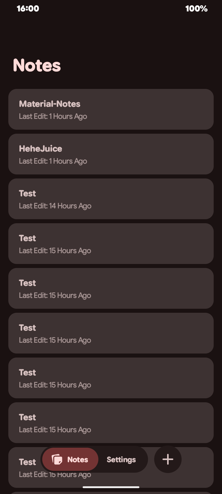
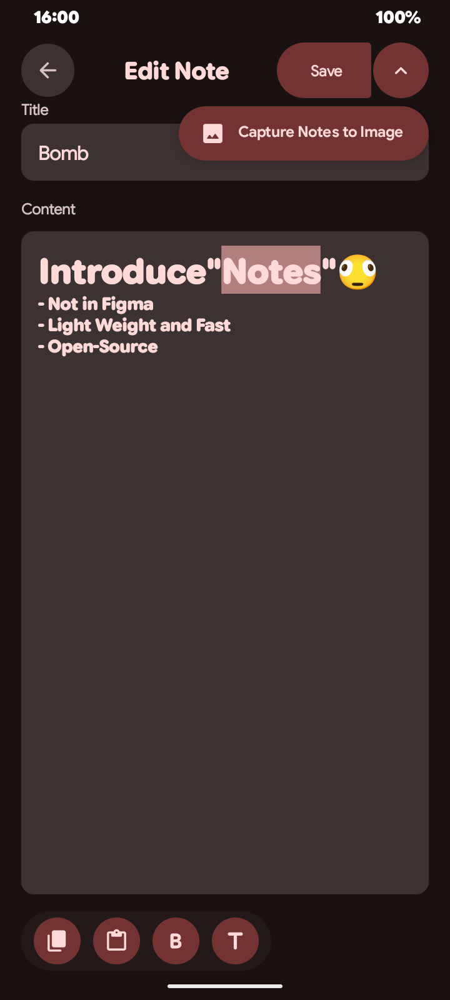
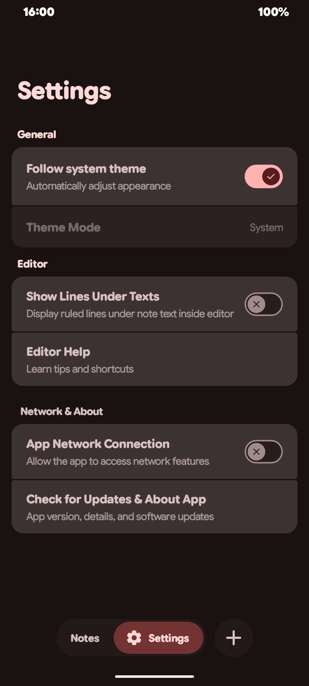
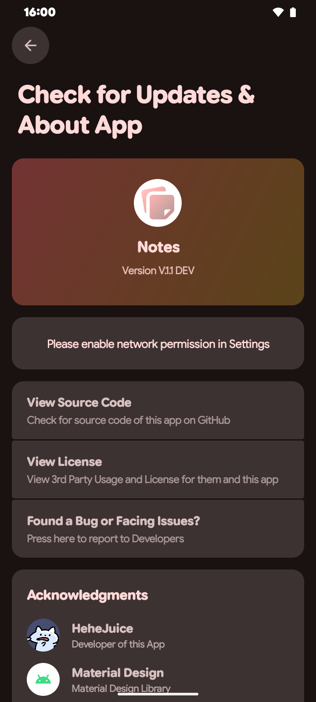

# Material-Notes 

### Simplify as "Notes"

> A Simple / Light-Weight Android Material Design Expressive Notes App

## Badges

## Features 

> Basic Notes feature using .txt

> Notes to Image

> Material Design Expressive 

## Screenshots

  
  
  
  

## Acknowledgements

> This project uses codes from the following projects 

> [Google / Google Sans Flex](https://design.google/library/google-sans-flex-font)

> [Google / Material Design](https://m3.material.io)

## Join Us

